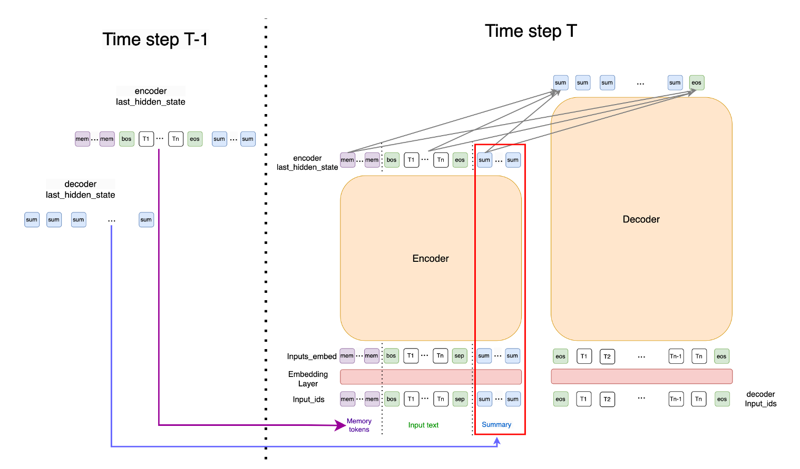

# prompt-for-long-text-summarization

## project structure

```
project/
|-- config/
|   |-- config.py
|-- datasets/
|-- logs/
|-- models/
|   |-- base.py                   -> RMT base model
|   |-- modeling_bart             -> custom bart model (PrefixProp) 
|   |-- summarization             -> custom downstream class for our task
|   |-- prefix_encoder             -> for prompt generation
|-- utils/
|-- script/                       -> task specific run script
|-- run_summarization.py          -> training
|-- ...
|-- arguments.py                  -> training_args
|-- requirements.txt  
```

## Dataset Statistic

* **Pubmed statistic:**

  | Split | samples |
  | :---: | :-----: |
  | Train | 119924 |
  |  Val  |  6633  |
  | Test |  6658  |
* **Final statistic after preprocessing**

  | Split | samples | section_avg_token_size | abstract_avg_token_size |
  | :---: | :-----: | :--------------------: | :---------------------: |
  | Train |  24843  |          2740          |           299           |
  |  Val  |  1399  |          2752          |           300           |
  | Test |  1431  |          2732          |           303           |
* **a sample of vanilla dataset**

  * labels seems to used for classification task, the labels of vanilla datasets are all None, i didn't do any processing.

  |     article_id     |                                article_text                                |                                                                                                                                                                                                                                                                                                                                                                                                                                                                                                                                                                                                                                                                                                                                                                                                                                                                                                                               abstract_text                                                                                                                                                                                                                                                                                                                                                                                                                                                                                                                                                                                                                                                                                                                                                                                                                                                                                                                               | labels |                                                                                                                                                                                                             section_names                                                                                                                                                                                                             |                                     sections                                     |
  | :----------------: | :------------------------------------------------------------------------: | :-----------------------------------------------------------------------------------------------------------------------------------------------------------------------------------------------------------------------------------------------------------------------------------------------------------------------------------------------------------------------------------------------------------------------------------------------------------------------------------------------------------------------------------------------------------------------------------------------------------------------------------------------------------------------------------------------------------------------------------------------------------------------------------------------------------------------------------------------------------------------------------------------------------------------------------------------------------------------------------------------------------------------------------------------------------------------------------------------------------------------------------------------------------------------------------------------------------------------------------------------------------------------------------------------------------------------------------------------------------------------------------------------------------------------------------------------------------------------------------------------------------------------------------------------------------------------------------------------------------------------------------------------------------------------------------------------------------------------------------------------------------------------------------------------------------------------------------------------------------------------: | :----: | :-----------------------------------------------------------------------------------------------------------------------------------------------------------------------------------------------------------------------------------------------------------------------------------------------------------------------------------------------------------------------------------------------------------------------------------: | :-------------------------------------------------------------------------------: |
  |        str        |                                 List[str]                                 |                                                                                                                                                                                                                                                                                                                                                                                                                                                                                                                                                                                                                                                                                                                                                                                                                                                                                                                                 List[str]                                                                                                                                                                                                                                                                                                                                                                                                                                                                                                                                                                                                                                                                                                                                                                                                                                                                                                                                 |  None  |                                                                                                                                                                                                               List[str]                                                                                                                                                                                                               |                                  List[List[str]]                                  |
  |    'PMC3872579'    | split by sentence `<br>`(似乎按照句子进行分割了, 如果要使用需要进行join) | ['`<BOS>` background : the present study was carried out to assess the effects of community nutrition intervention based on advocacy approach on malnutrition status among school - aged children in shiraz , iran.materials and methods : this case - control nutritional intervention has been done between 2008 and 2009 on 2897 primary and secondary school boys and girls ( 7 - 13 years old ) based on advocacy approach in shiraz , iran . `</EOS>`', `<br>` '`<BOS>` the project provided nutritious snacks in public schools over a 2-year period along with advocacy oriented actions in order to implement and promote nutritional intervention . for evaluation of effectiveness of the intervention growth monitoring indices of pre- and post - intervention were statistically compared.results:the frequency of subjects with body mass index lower than 5% decreased significantly after intervention among girls ( p = 0.02 ) . `</EOS>`', `<br>` '`<BOS>` however , there were no significant changes among boys or total population . `</EOS>`', `<br>` '`<BOS>` the mean of all anthropometric indices changed significantly after intervention both among girls and boys as well as in total population . `</EOS>`', `<br>` "`<BOS>` the pre- and post - test education assessment in both groups showed that the student 's average knowledge score has been significantly increased from 12.5  3.2 to 16.8  4.3 ( p < 0.0001).conclusion : this study demonstrates the potential success and scalability of school feeding programs in iran . `</EOS>`", `<br>` '`<BOS>` community nutrition intervention based on the advocacy process model is effective on reducing the prevalence of underweight specifically among female school aged children . `</EOS>`'] `<br>` 分割方式不明, 需要进行join并重新分割 |  None  | ['INTRODUCTION',`<br>`'MATERIALS AND METHODS', `<br>`'Participants'Instruments', `<br>`'Procedure', `<br>`'First step', `<br>`'Second step', `<br>`'Third step', `<br>`'Forth step', `<br>`'Interventions', `<br>`'Fifth step (assessment)', `<br>`'Data analysis', `<br>`'RESULTS', `<br>`'DISCUSSION', `<br>`'CONCLUSION'] `<br><br>`请注意METHODS包含了从Participants'Instruments到Data analysis的部分 | [`<br>`section[seq1, seq2, ...], `<br>`section[seq1, seq2, ...], `<br>`...] |
  | reformat之后的格式 |                                    :-:                                    |                                                                                                                                                                                                                                                                                                                                                                                                                                                                                                                                                                                                                                                                                                                                                                                                                                                                                                                                    :-:                                                                                                                                                                                                                                                                                                                                                                                                                                                                                                                                                                                                                                                                                                                                                                                                                                                                                                                                    |  :-:  |                                                                                                                                                                                                                  :-:                                                                                                                                                                                                                  |                                        :-:                                        |
  |        str        |                                 List[str]                                 |                                                                                                                                                                                                                                                                                                                                                                                                                                                                                                                                                                                                                                                                                                                                                                                                                                                                                                                           list[str]Result Table                                                                                                                                                                                                                                                                                                                                                                                                                                                                                                                                                                                                                                                                                                                                                                                                                                                                                                                           |        |                                                                                                                                                                                                                                                                                                                                                                                                                                      |                                                                                  |

CNN-DailyMail

|          Model          | pre_seq_len | post_seq_len | Model fixed | train sample | eval/pred sample | rouge1 | rouge2 | rougeL | batch_size |
| :---------------------: | :---------: | :----------: | :---------: | :----------: | :--------------: | :----: | :----: | :----: | :--------: |
|        Bart-base        |      0      |      0      |    True    |     100     |        50        | 31.97 | 12.91 | 21.51 |   1 * 4   |
| Bart-base Prefix-tuning |     20     |      0      |    True    |     100     |        50        | 19.48 |  5.68  | 18.55 |   1 * 4   |
|  Bart-base Prefix-Prop  |     20     |      0      |    False    |     100     |        50        | 32.17 | 13.50 | 29.24 |   1 * 4   |
|  Bart-base Prefix-Prop  |     20     |      0      |    False    |    287113    |   13368/11490   | 42.86 | 20.09 | 36.71 |   8 * 4   |
|  Bart-base Prefix-Prop  |     20     |      0      |    True    |     100     |        50        | 30.47 | 13.09 | 27.73 |   1 * 4   |
| Bart-large Prefix-Prop |     20     |      0      |    False    |    287113    |   13368/11490   | 44.01 | 20.94 | 41.06 |   8 * 4   |

PubMed

|     Model     | pre_seq_len | post_seq_len |                max_source_length                | Model fixed | train sample | eval/pred sample | rouge1 | rouge2 | rougeL | batch_size |
| :-----------: | :---------: | :----------: | :---------------------------------------------: | :---------: | :----------: | :--------------: | :----: | :----: | :----: | :--------: |
|   Bart-base   |      0      |      0      |                       861                       |    False    |    24843    |    1399/1431    | 53.29 | 25.78 | 49.06 |   4 * 3   |
|   Bart-base   |      0      |      0      |                      1003                      |    False    |    24843    |    1399/1431    | 53.67 | 26.44 | 49.56 |   4 * 3   |
|   Bart-base   |      0      |      0      |                      1024                      |    False    |    24843    |    1399/1431    | 53.80 | 26.55 | 49.70 |   4 * 3   |
| Bart-base-RMT |     20     |      0      | 1003 `<br>`(1024 - 20 - 0) `<br>` -1 (bos) |    False    |    24843    |    1399/1431    | 46.03 | 20.49 | 42.02 |   4 * 3   |
| Bart-base-RMT |     20     |     142     | 861 `<br>`(1024 - 20 - 142) `<br>` -1 (bos) |    False    |    24843    |    1399/1431    | 46.43 | 20.82 | 42.52 |   4 * 3   |

PubMed Incremental

|     Model     | pre_seq_len | post_seq_len |         max_source_length         | max_target_length | Model fixed | train sample | eval/pred sample | rouge1 | rouge2 | rougeL | batch_size | length_penalty |
| :-----------: | :---------: | :----------: | :--------------------------------: | :---------------: | :---------: | :----------: | :--------------: | :----: | :----: | :----: | :--------: | -------------- |
|   Bart-base   |     r60     |      0      |                1024                |        300        |    False    |    24843    |    1399/1431    | 50.84 | 20.56 | 49.55 |   2 * 3   |                |
|   Bart-base   |      0      |      0      |                703                |        300        |    False    |    24843    |    1399/1431    | 50.26 | 20.19 | 48.99 |   2 * 3   |                |
|   Bart-base   |      0      |      0      |                747                |        256        |    False    |    24843    |    1399/1431    | 49.97 | 19.93 | 48.65 |   2 * 3   |                |
|   Bart-base   |      0      |      0      |  767 `<br>`(1024 - 256 - 0 - 1)  |        256        |    False    |    24843    |    1399/1431    | 49.92 | 19.92 | 48.61 |   2 * 3   |                |
|   Bart-base   |      0      |      0      |  823 `<br>`(1024 - 200 - 0 - 1)  |        256        |    False    |    24843    |    1399/1431    | 50.09 | 19.91 | 48.75 |   2 * 3   |                |
| Bart-base-RMT |     20     |     300     | 703 `<br>`(1024 - 20 - 300 - 1) |        300        |    False    |    24843    |    1399/1431    | 45.36 | 16.94 | 44.14 |   2 * 3   |                |
| Bart-base-RMT |     20     |     256     | 747 `<br>` (1024 - 20 - 256 - 1) |        256        |    False    |    24843    |    1399/1431    | 46.21 | 17.24 | 44.96 |   2 * 3   |                |
| Bart-base-RMT |     32     |     256     | 1023 `<br>`(1024 - 32 - 256 - 1) |        256        |    False    |    24843    |    1399/1431    | 45.63 | 17.17 | 44.52 |   2 * 3   |                |
| Bart-base-RMT |     64     |     256     | 1023 `<br>`(1024 - 32 - 256 - 1) |        256        |    False    |    24843    |    1399/1431    | 46.63 | 17.91 | 45.39 |   2 * 3   |                |
| Bart-base-RMT |     128     |     256     | 1023 `<br>`(1024 - 32 - 256 - 1) |        256        |    False    |    24843    |    1399/1431    | 46.27 | 17.63 | 45.04 |   2 * 3   |                |
| Bart-base-RMT |     150     |     256     |                617                |        256        |    False    |    24843    |    1399/1431    | 46.67 | 17.98 | 45.42 |   2 * 3   |                |
| Bart-base-RMT |     256     |     256     |                617                |        256        |    False    |    24843    |    1399/1431    | 46.24 | 17.85 | 45.01 |   2 * 3   |                |
| Bart-base-RMT |     20     |      0      |  1003 `<br>`(1024 - 20 - 0 - 1)  |        256        |    False    |    24843    |    1399/1431    | 47.50 | 18.13 | 46.16 |   2 * 3   |                |
| Bart-base-RMT |      0      |     256     |  1023 `<br>`(1024 - 0 - 0 - 1)  |        256        |    False    |    24843    |    1399/1431    | 43.97 | 15.44 | 42.77 |   2 * 3   |                |
| Bart-base-RMT |     64     |      0      |  1023 `<br>`(1024 - 0 - 0 - 1)  |        256        |    False    |    24843    |    1399/1431    | 47.63 | 18.32 | 46.31 |   2 * 3   |                |
| Bart-base-RMT |     128     |      0      |                ---                |        256        |    False    |    24843    |    1399/1431    | 48.69 | 18.95 | 47.36 |            |                |
| Bart-base-RMT |     150     |      0      |                ---                |        256        |    False    |    24843    |    1399/1431    | 49.41 | 19.64 | 48.04 |            |                |
| Bart-base-RMT |     175     |      0      |                ---                |        256        |    False    |    24843    |    1399/1431    | 49.05 | 19.14 | 47.71 |            |                |
| Bart-base-RMT |     200     |      0      |                ---                |        256        |    False    |    24843    |    1399/1431    | 49.23 | 19.23 | 47.88 |            |                |
| Bart-base-RMT |     256     |      0      |                                    |                  |            |              |                  | 49.50 | 19.60 | 48.17 |            |                |
| Bart-base-RMT |     256     |      0      |                                    |        312        |            |              |                  | 49.38 | 19.47 | 48.07 |            | 2.0            |
|              |     256     |      0      |                                    |        312        |            |              |                  |        |        |        |            | 3.0            |

|   Model   | pre_seq_len | post_seq_len | max_source_length | max_target_length | rouge1 | rouge2 | rougeL | batch_size |  lr  |  |
| :-------: | :---------: | :----------: | :---------------: | :---------------: | :----: | :----: | :----: | :--------: | :--: | :-: |
| Bart-base |      0      |      0      |        512        |        300        | 49.35 | 19.38 | 48.05 |   2 * 3   | 5e-5 |  |
|    RMT    |     20     |      0      |        512        |        300        | 48.94 | 18.76 | 47.66 |   2 * 3   | 5e-5 |  |
|    RMT    |     32     |      0      |        512        |        300        | 49.44 | 19.16 | 48.14 |   2 * 3   | 5e-5 |  |
|    RMT    |     64     |      0      |        512        |        300        | 49.14 | 18.79 | 47.85 |   2 * 3   | 5e-5 |  |
|    RMT    |     100     |      0      |        512        |        300        | 49.83 | 19.66 | 48.52 |   2 * 3   | 5e-5 |  |
|    RMT    |     128     |      0      |        512        |        300        | 50.04 | 19.75 | 48.72 |   2 * 3   | 5e-5 |  |
|    RMT    |     150     |      0      |        512        |        300        | 50.15 | 19.91 | 48.85 |   2 * 3   | 5e-5 |  |
|    RMT    |     200     |      0      |        512        |        300        | 50.59 | 20.24 | 49.31 |   2 * 3   | 5e-5 |  |
|    RMT    |     212     |      0      |        512        |        300        | 50.25 | 20.03 | 48.95 |   2 * 3   | 5e-5 |  |
|    RMT    |     256     |      0      |        512        |        300        | 50.25 | 20.03 | 48.92 |   2 * 3   | 5e-5 |  |
|    RMT    |      0      |     300     |        512        |        300        | 41.86 | 14.25 | 40.72 |   2 * 3   | 5e-5 |  |
|    RMT    |     20     |     300     |        512        |        300        | 44.03 | 16.23 | 42.86 |   2 * 3   | 5e-5 |  |
|    RMT    |     32     |     300     |        512        |        300        | 45.39 | 16.73 | 44.18 |   2 * 3   | 5e-5 |  |
|    RMT    |     64     |     300     |        512        |        300        | 45.98 | 17.47 | 44.79 |   2 * 3   | 5e-5 |  |
|    RMT    |     100     |     300     |        512        |        300        | 46.28 | 17.85 | 45.06 |   2 * 3   | 5e-5 |  |
|    RMT    |     128     |     300     |        512        |        300        | 45.83 | 17.32 | 44.60 |   2 * 3   | 5e-5 |  |
|    RMT    |     150     |     300     |        512        |        300        |        |        |        |   2 * 3   | 5e-5 |  |
|    RMT    |     200     |     300     |        512        |        300        |        |        |        |   2 * 3   | 5e-5 |  |
|    RMT    |     212     |     300     |        512        |        300        | 45.73 | 17.81 | 44.51 |   2 * 3   | 5e-5 |  |

**NLP_JP_CORPUS_INCREMENTAL**

|   Model   | pre_seq_len | post_seq_len | max_source_length | max_target_length | rouge1 | rouge2 | rougeL | batch_size | lr   |
| :-------: | :---------: | :----------: | :---------------: | :---------------: | :----: | :----: | :----: | :--------: | ---- |
| Bart-base |      0      |      0      |        512        |        300        | 51.62 | 19.84 | 50.49 |   1 * 3   | 3e-6 |
|    RMT    |     20     |      0      |        512        |        300        | 50.75 | 20.18 | 49.02 |   1 * 3   | 3e-6 |
|    RMT    |     32     |      0      |        512        |        300        | 50.89 | 20.21 | 49.01 |   1 * 3   | 3e-6 |
|    RMT    |     64     |      0      |        512        |        300        | 50.66 | 20.17 | 48.85 |   1 * 3   | 3e-6 |
|    RMT    |     100     |      0      |        512        |        300        | 51.44 | 19.51 | 49.58 |   1 * 3   | 3e-6 |
|    RMT    |     128     |      0      |        512        |        300        | 51.70 | 19.53 | 49.67 |   1 * 3   | 3e-6 |
|    RMT    |     150     |      0      |        512        |        300        | 52.05 | 19.89 | 49.94 |   1 * 3   | 3e-6 |
|    RMT    |     200     |      0      |        512        |        300        | 51.16 | 19.87 | 49.31 |   1 * 3   | 3e-6 |
|    RMT    |     256     |      0      |        512        |        300        | 50.82 | 19.53 | 48.98 |   1 * 3   | 3e-6 |

## Model Architecture



## TODO

1. 看一下数据集的结构 ｜ 包括JST数据集
   1. 在JST数据集上进行测试
   2. 对文本数据集进行一个处理
      1. 文本本身需要进行分割：或许根据keyword进行一个rule-based的划分
      2. summary根据DANCER的方法进行一个相似度匹配来进行划分
2. 研究一下BART-japanese怎么用
3. 重新写一个新的run_summarization_japanese
